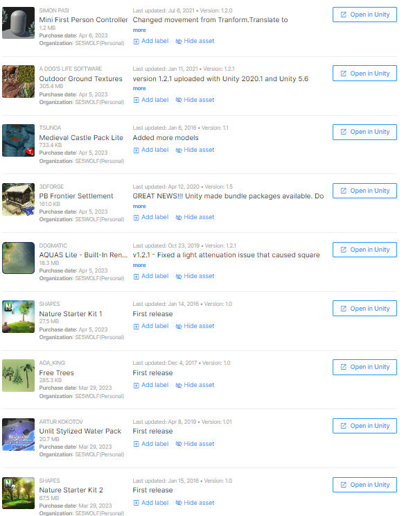

# UnityIsland

## Программы
- **Unity**
## Актуальность
Разработки на Unity остаются актуальными и популярными в сфере создания компьютерных игр и индустриальной визуализации. Unity предлагает инструменты для создания игр на различных платформах, включая мобильные устройства, настольные компьютеры, консоли и виртуальную реальность. В Unity удобно создавать многопользовательские игры, а также интегрировать в них искусственный интеллект и системы физического движения.

 
<i>кроссплатформенная среда разработки</i>

  

## Использованные модификации (**Асеты**)

Для выполнения работы были использованы следующие асеты.

 
<i>Использованные асеты</i>

## Создания локации

С помощью **terrain** мы создаём очертания нашего ланшафта, важным замечанием является то что мы поднимаем всю локацию, а только потом убираем лишнию часть "земли" для создания водоёмов. В дальнейшем мы рисуем текстурами (**paint texture**) на данном терейне, создаём деревья (**paint trees**). Создаём замок из скаченных асетов, добавляем ему коллизию (**box collider**). Добавляем асет на персонажа и камеру для движения по локации. Для создания воды - создаём **plane** и накладываем на него теустуру из скаченного асета, теперь наша вода имеет красивую анимацию. Также добавляем визуальный эффект на камеру, похожий на попадание ярких солнечных лучей в глаза.

 
<i>Общий вид локации</i>

## Инструменты камеры
  
По сюжеты локации, при заходе в воду персонажу становится холодно, что и накладывает синий фильтр на камеру. Для этого создадим пустой объект **empty**, после чего включим функцию is trigger в "box collider", для того чтобы персонаж мог через него двигаться. Увеличим размер empty чтобы он покрывал всю воду на локации. Добавим **post-process volume** -  компонент, который позволяет управлять приоритетом и смешиванием эффектов, через него мы сможем наложить цвет на нашу камеру.
  

 
<i>Наложение эффекта</i>

  
## Вывод

Данные проекты помог мне познакомится с движком Unity, что является полезным и интересным навыком для моей профессии.

### Контакты
* VK: <a href="https://vk.com/doobada">Артём Богданов</a>
* mail: bogdanov200412@gmail.com
